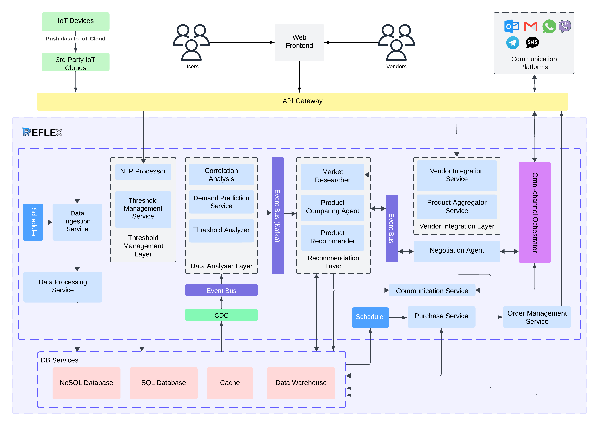

# Reflex - Next-Generation E-Commerce Machine Customer Platform

## Overview

Reflex is an innovative platform designed to revolutionize the e-commerce experience by leveraging the concept of **Machine Customers**. These are autonomous AI agents capable of shopping on behalf of users, making data-driven purchasing decisions, and optimizing the entire shopping process. Reflex integrates advanced technologies, including Generative AI, IoT, and machine learning, to create a seamless, personalized, and efficient shopping experience.

## Key Features

- **Autonomous Shopping**: AI agents evaluate products, compare deals, and make purchasing decisions based on user-defined preferences.
- **User and Device Onboarding**: Easy setup for new and existing users, including IoT device integration.
- **Dynamic Thresholds**: Configure automatic replenishment thresholds (e.g., order more coffee pods when supply drops below 10).
- **Market Research**: AI agents conduct market research to recommend the best products and deals.
- **Compliance and Vendor Integration**: Ensures compliance with user preferences and integrates with multiple vendors for seamless transactions.
- **Order Management**: Tracks orders, manages deliveries, and handles returns or exchanges.
- **Demand Prediction**: Utilizes data analysis and correlation modules to predict product demand accurately.
- **IoT Integration**: Leverages IoT devices to monitor usage and trigger automatic replenishment.

## Solution Architecture


### Data Flow Diagram
.png)

### Use Case Diagram
.png)

## How It Works

1. **User Onboarding**: Users set up their preferences and configure thresholds for automatic replenishment.
2. **Device Integration**: IoT devices are onboarded to monitor usage and send data to the platform.
3. **Market Research**: AI agents conduct market research to find the best products and deals.
4. **Product Comparison**: Agents compare products based on user-defined criteria.
5. **Automatic Ordering**: When thresholds are met, agents automatically place orders.
6. **Order Management**: The platform tracks orders, manages deliveries, and handles returns or exchanges.
7. **Demand Prediction**: Advanced data analysis predicts future demand, ensuring timely replenishment.

## Getting Started

### Prerequisites

- Python 3.8+
- Docker
- Kubernetes (optional for deployment)
- IoT devices (optional for integration)

### Installation

1. Clone the repository:
   ```bash
   git clone https://github.com/your-username/reflex-platform.git
   cd reflex-platform
   ```

2. Set up the environment:
   ```bash
   python -m venv venv
   source venv/bin/activate
   pip install -r requirements.txt
   ```

3. Run the platform:
   ```bash
   python main.py
   ```

### Configuration

- **User Preferences**: Configure user preferences and thresholds in `config/user_preferences.json`.
- **Vendor Integration**: Add vendor details in `config/vendors.json`.
- **IoT Devices**: Set up IoT device integration in `config/iot_devices.json`.

## Contributing

We welcome contributions from the community! Please read our [CONTRIBUTING.md](CONTRIBUTING.md) for details on how to submit pull requests, report issues, and suggest enhancements.

## License

This project is licensed under the MIT License - see the [LICENSE](LICENSE) file for details.

## Acknowledgments

- Reference Material: [Machine Customers Will Decide Who Gets Their Trillion-Dollar Business—Is It You?](https://example.com)

## Contact

For any inquiries, please contact us at [your-email@example.com](mailto:your-email@example.com).

---

Reflex is designed to bring the future of e-commerce to the present, making shopping smarter, faster, and more efficient. Join us in revolutionizing the way we shop!